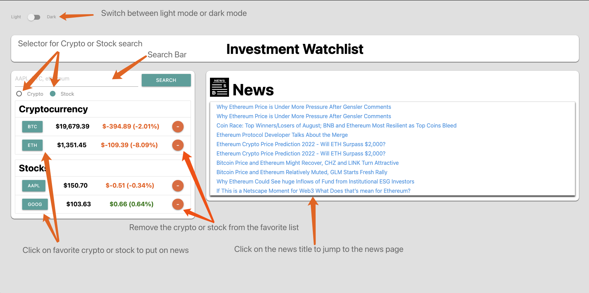
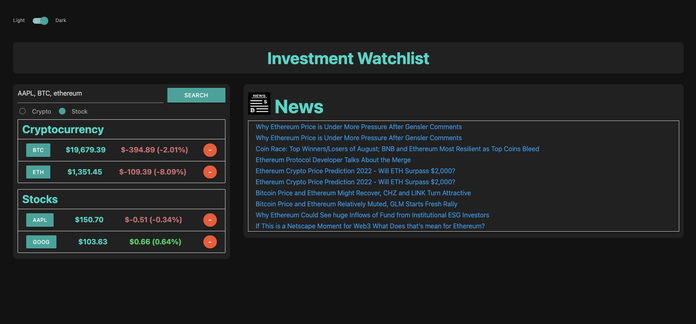

# Investment Watchlist

## Deployment Link

## Introduction
This project was created using HTML, CSS, and javascript. It is a investment watchlist that uses Materialize css framework. 

## Acceptance Criteria
GIVEN I am using an investment watchlist 
WHEN I open watchlist 
THEN the previously added cryptocurrency and stock will be displayed 
WHEN I search for the cryptocurrency or stock 
THEN it will be added to the favorite list and the news will be displayed 
WHEN I click on the symbol of the investment 
THEN news of symbol will be displayed 
WHEN I click on title of news section 
THEN I will be redirected to the URL of the news 
WHEN I click on toggle for light or dark mode 
THEN it will switch between light or dark 
WHEN I click on delete button 
THEN the item I clicked will be removed

## Screenshots

## Credit
Crypto news / home screen - Brian Zoulko (bzoulko) 
Crypto symbols / debugging - Joon Park (jsp220) 
Stock symbols / Stock news - Qi Chen (ricky8221) 
Dark mode / debugging / design - Ryan Dao (ryedao)
